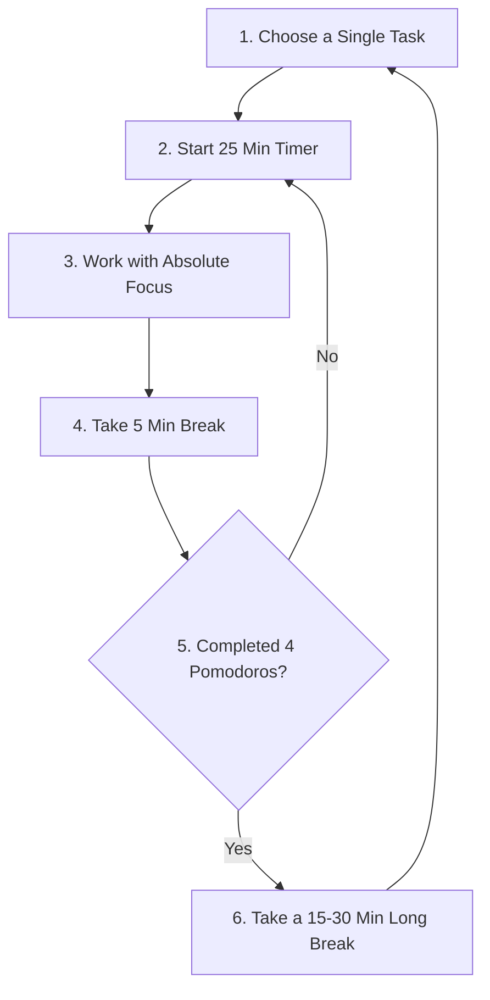

## What Is the Pomodoro Technique?

procrastination is rarely a time-management problem—it is usually an **emotion-regulation problem**. Facing a massive, complex task can feel overwhelming, causing your brain to seek immediate comfort elsewhere (like social media).

The **Pomodoro Technique**—invented in the late 1980s by Francesco Cirillo—heals this block by breaking work down into short, highly manageable intervals. 

Traditionally, you work with single-minded focus for **25 minutes**, followed by a **5-minute break**. Each 25-minute sprint is called a "pomodoro" (Italian for tomato, named after the tomato-shaped kitchen timer Cirillo used).

Let's explore the scientific reasons why this technique works and how you can apply it using our free **[Pomodoro Timer](/pomodoro-timer)**.

---

## The Science of Pomodoro Breaks

Why work for 25 minutes instead of pushing through for 4 hours straight? Research in cognitive psychology outlines key biological factors:

### 1. Prefrontal Cortex Fatigue
Your prefrontal cortex (PFC) is responsible for decision making, willpower, and sustained focus. Like a muscle, it runs out of glycogen and tires under continuous stress. Enforcing a 5-minute break resets your attention span and prevents mental fatigue.

### 2. Default Mode Network (DMN) Activation
When you are focusing intently, your brain's *Executive Network* is active. When you step away and rest, your *Default Mode Network* takes over. The DMN is responsible for making background connections, solving complex problems, and generating creative insights. This is why "Aha!" moments often happen in the shower or during a walk.

### 3. Combating Time Blindness
For individuals with ADHD or high levels of stress, estimating how long a task will take is difficult. The ticking timer acts as an external physical cue, keeping the brain grounded in the passage of time.

---

## Step-by-Step Pomodoro Cycle

To execute the method perfectly, follow these steps:

1. **Write down your tasks:** Add tasks to your list and prioritize them.
2. **Work for 25 minutes:** Mute all notifications. Work on nothing but the chosen task.
3. **Rest for 5 minutes:** Stand up, stretch, drink water, or look away from screens. Do not check emails or social media.
4. **Repeat 4 times:** After completing 4 focus sprints, reward yourself with a longer **15 to 30-minute break**.

---

## Customizing Durations for Different Tasks

The classic 25/5 split is a great starting point, but you can adjust settings inside our **[Pomodoro Timer](/pomodoro-timer)** to match your specific style of work:

| Work Type | Focus Sprint | Short Break | Best For |
|---|---|---|---|
| **Quick Wins / Low Motivation** | **15 minutes** | **3 minutes** | Getting started when feeling extremely unmotivated or overwhelmed. |
| **Traditional Pomodoro** | **25 minutes** | **5 minutes** | General tasks, writing emails, studying, or reviewing articles. |
| **Deep Work / Coding / Writing** | **50 minutes** | **10 minutes** | Complex programming, deep research, design projects, or editing drafts. |
| **Ultradian Rhythm** | **90 minutes** | **20 minutes** | Aligning with the human body's natural 90-minute biological cycles. |

---

## Common Pomodoro Mistakes to Avoid

* **Working through breaks:** It is tempting to keep going if you are in flow. However, skipping breaks wears down your willpower, leading to burnout later in the day.
* **Checking social media during breaks:** Checking feeds requires active attention and dopamine processing. This does not let your prefrontal cortex rest.
* **Multitasking during a sprint:** If you write an essay while answering Slack messages, you lose the benefits of single-task focus. Respect the boundary of your pomodoro.

---

> **[Pomodoro Timer](/pomodoro-timer)** — Track your daily focus sessions, log custom tasks, adjust volume alerts, and run sessions offline in your browser.
